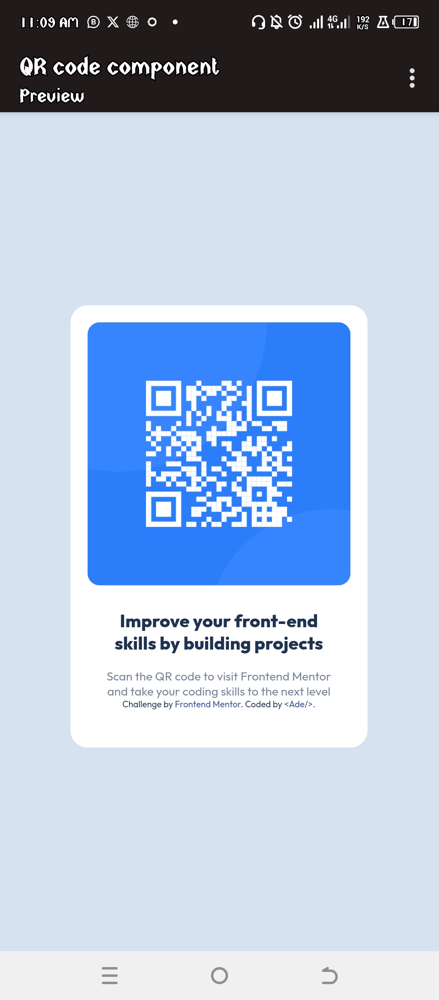

# Frontend Mentor - QR code component solution

This is a solution to the [QR code component challenge on Frontend Mentor](https://www.frontendmentor.io/challenges/qr-code-component-iux_sIO_H). 

## Table of contents

- [Overview] 
  - [Screenshot] (#screenshot)
  - [Links](#links)
- [My process](#my-process)
  - [Built with](#built-with)
  - [What I learned](#what-i-learned)
- [Author](#author)
- [Acknowledgments](#acknowledgments)


## Overview

### Screenshot




### Links

- Solution URL: [solution URL ](https://ademedia.github.io/qr-code/)
- Live Site URL: [/ive site URL ](https://ademedia.github.io/qr-code/)

## My process

**HTML Structure**

I started by creating Div named "container" and then put another div inside named "Card".

I placed the qr code image inside the card div.

I create another div to hold my text and add h2 heading and a paragraph in it.

I also create another div for attribution to frontEnd mentor and myside "#".

**CSS Styling**
I import the font family from Google font using the @import selector.

I add a universal selector(*) to set margin and padding to 0 

Then use the body selector to add background-color and other styles to the body.


### Built with
- CSS custom properties
- Flexbox

### What I learned
 
 I learned how to center a div using the display flex and aligning items to center. 

```html
<div class="container">I'm proud of this cos i use it to contain all the content</div>
```
```css
body {
    display: flex; /* Display flex to align the content to center*/
  align-items: center;
  font-size: 15px;
}
.card {
  margin: 0 1.5em;  /* Margin used to make the card responsive and adding 1.5em to left and right margin */
}
```

## Author

- Website - [Website 🔜](https://www.github/ademedia.io)
- Frontend Mentor - [@Ademedia](https://www.frontendmentor.io/profile/ademedia)
- Twitter - [@AdeDevGEE](https://www.x.com/adedevgee)


## Acknowledgments

Thanks to My Css Reference book 🤛
and Front-end master for the instructions.
